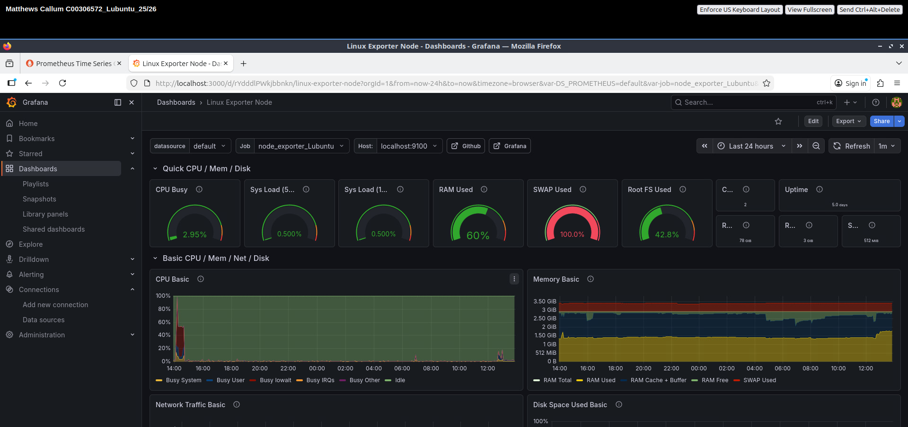
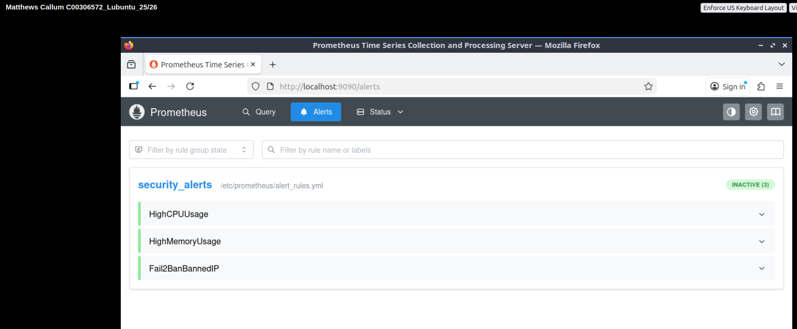

# Promethues-Grafana-Fail2Ban-System-Monitoring
Project completed during the Systems Infrastructure and Security Module in Year 2 Semester 2 at SETU Carlow.
I received a grade of 84% in this module.

This project's aim was to set up a monitoring and security environment configured across two Linux virtual machines using Prometheus, Grafana, Fail2Ban, and Alertmanager and was completed with the use of virtual machines





---

## Environment Overview

| Machine | OS | IP Address | Role |
|---|---|---|---|
| Lubuntu | Lubuntu (Ubuntu-based) | 192.168.56.20 | Primary server — runs Prometheus, Grafana, Alertmanager |
| Rocky Linux | Rocky Linux (RHEL-based) | 192.168.56.10 | Secondary server — monitored target |

---

## Architecture

- **Node Exporter** runs on both machines and exposes system metrics on port 9100
- **Prometheus** (on Lubuntu) scrapes metrics from both machines at regular intervals
- **Grafana** connects to Prometheus and visualises metrics via two dashboards
- **Fail2Ban** runs on both machines to monitor SSH login attempts and ban suspicious IPs
- **Fail2Ban Textfile Collector** exports Fail2Ban metrics to Prometheus via Node Exporter
- **Alertmanager** handles alert routing and sends notifications to Discord when thresholds are breached

---

## Repository Files

| File | Applies To | Description |
|---|---|---|
| `prometheus.yml` | Lubuntu only | Main Prometheus config — defines scrape targets and alerting |
| `alert_rules.yml` | Lubuntu only | Prometheus alert rules for CPU, memory and Fail2Ban events |
| `prometheus.service` | Lubuntu only | Systemd service file for Prometheus |
| `alertmanager.yml` | Lubuntu only | Alertmanager config — Discord webhook notification setup |
| `alertmanager.service` | Lubuntu only | Systemd service file for Alertmanager |
| `node_exporter.service` | Both machines | Systemd service file for Node Exporter (includes textfile collector flag) |
| `fail2ban-metrics.sh` | Both machines | Bash script that exports Fail2Ban metrics for Prometheus |
| `jail.local` | Both machines | Fail2Ban jail configuration for SSH monitoring |

> **Note:** `node_exporter.service`, `fail2ban-metrics.sh` and `jail.local` are identical across both machines and are shared here as a single file.

---

## Tools Used

| Tool | Version | Purpose |
|---|---|---|
| Prometheus | 3.10.0 | Metrics collection and alerting |
| Node Exporter | 1.8.2 | System metrics exporter |
| Grafana | Latest (apt) | Metrics visualisation |
| Fail2Ban | Latest (apt/dnf) | SSH brute force protection |
| Alertmanager | 0.27.0 | Alert routing and Discord notifications |

---

## Web Interfaces

All accessible from Lubuntu:

| Service | URL |
|---|---|
| Prometheus | http://localhost:9090 |
| Prometheus Targets | http://localhost:9090/targets |
| Prometheus Alerts | http://localhost:9090/alerts |
| Grafana | http://localhost:3000 |
| Alertmanager | http://localhost:9093 |

---

## Installation Overview

### Prometheus (Lubuntu only)
```bash
# Download from https://prometheus.io/download/ and extract
sudo mv prometheus /usr/local/bin/
sudo mv promtool /usr/local/bin/
sudo mkdir /etc/prometheus
sudo mkdir /var/lib/prometheus
sudo mv prometheus.yml /etc/prometheus/
sudo useradd --no-create-home --shell /bin/false prometheus
sudo chown -R prometheus:prometheus /etc/prometheus /var/lib/prometheus
sudo chown prometheus:prometheus /usr/local/bin/prometheus /usr/local/bin/promtool
# Copy prometheus.service to /etc/systemd/system/
sudo systemctl daemon-reload
sudo systemctl enable prometheus
sudo systemctl start prometheus
```

### Node Exporter (Both machines)
```bash
# Download from https://github.com/prometheus/node_exporter/releases and extract
sudo mv node_exporter /usr/local/bin/
sudo useradd --no-create-home --shell /bin/false node_exporter
sudo chown node_exporter:node_exporter /usr/local/bin/node_exporter
# Copy node_exporter.service to /etc/systemd/system/
sudo systemctl daemon-reload
sudo systemctl enable node_exporter
sudo systemctl start node_exporter
```

> **Rocky Linux only:** Install wget first with `sudo dnf install wget -y`. If the service fails with `status=203/EXEC`, run `sudo restorecon -v /usr/local/bin/node_exporter` to fix SELinux permissions. Also open the firewall:
> ```bash
> sudo firewall-cmd --permanent --add-port=9100/tcp
> sudo firewall-cmd --reload
> ```

### Fail2Ban (Both machines)
**Lubuntu:**
```bash
sudo apt install fail2ban -y
sudo systemctl enable fail2ban
sudo systemctl start fail2ban
# Copy jail.local to /etc/fail2ban/
sudo systemctl restart fail2ban
sudo fail2ban-client status sshd
```

**Rocky Linux:**
```bash
sudo dnf install epel-release -y
sudo dnf install fail2ban -y
sudo systemctl enable fail2ban
sudo systemctl start fail2ban
# Copy jail.local to /etc/fail2ban/
sudo systemctl restart fail2ban
sudo fail2ban-client status sshd
```

### Fail2Ban Textfile Collector (Both machines)
```bash
# Create textfile collector directory
sudo mkdir -p /var/lib/node_exporter/textfile_collector

# Copy fail2ban-metrics.sh to /usr/local/bin/ and make executable
sudo chmod +x /usr/local/bin/fail2ban-metrics.sh

# Add cron job via sudo crontab -e:
* * * * * /usr/local/bin/fail2ban-metrics.sh > /var/lib/node_exporter/textfile_collector/fail2ban.prom

# Restart Node Exporter to apply textfile collector flag
sudo systemctl daemon-reload
sudo systemctl restart node_exporter
```

### Alertmanager (Lubuntu only)
```bash
# Download from https://github.com/prometheus/alertmanager/releases and extract
sudo mv alertmanager /usr/local/bin/
sudo mv amtool /usr/local/bin/
sudo mkdir /etc/alertmanager
sudo mv alertmanager.yml /etc/alertmanager/
sudo useradd --no-create-home --shell /bin/false alertmanager
sudo chown -R alertmanager:alertmanager /etc/alertmanager
sudo chown alertmanager:alertmanager /usr/local/bin/alertmanager /usr/local/bin/amtool
# Copy alertmanager.service to /etc/systemd/system/
sudo systemctl daemon-reload
sudo systemctl enable alertmanager
sudo systemctl start alertmanager
```

> **Discord webhook:** Create a webhook in your Discord server under Channel Settings → Integrations → Webhooks and replace `YOUR_DISCORD_WEBHOOK_URL_HERE` in `alertmanager.yml` with your URL.

### Grafana (Lubuntu only)
```bash
sudo apt install -y apt-transport-https software-properties-common wget
sudo mkdir -p /etc/apt/keyrings/
wget -q -O - https://apt.grafana.com/gpg.key | gpg --dearmor | sudo tee /etc/apt/keyrings/grafana.gpg > /dev/null
echo "deb [signed-by=/etc/apt/keyrings/grafana.gpg] https://apt.grafana.com stable main" | sudo tee /etc/apt/sources.list.d/grafana.list
sudo apt update
sudo apt install grafana -y
sudo systemctl enable grafana-server
sudo systemctl start grafana-server
```

**Setup steps:**
1. Navigate to `http://localhost:3000` and log in with `admin` / `admin`
2. Change password on first login
3. Go to Connections → Data Sources → Add data source → Prometheus → URL: `http://localhost:9090` → Save & Test
4. Import Dashboard 1: Dashboards → New → Import → ID `14513` → Select Prometheus data source → Import
5. Create Dashboard 2 manually with two Stat panels:
   - Panel 1: Query `fail2ban_banned_total`, Legend `{{job}}`, Title "Currently Banned IPs"
   - Panel 2: Query `fail2ban_failed_total`, Legend `{{job}}`, Title "Current Failed Login Attempts"

---

## Alerts Configured

| Alert | Condition | Severity |
|---|---|---|
| HighCPUUsage | CPU > 80% for 2 minutes | Critical |
| HighMemoryUsage | Memory > 80% for 2 minutes | Warning |
| Fail2BanBannedIP | Banned IPs > 0 for 1 minute | Warning |

---

## Key File Locations

### Lubuntu
| File | Path |
|---|---|
| Prometheus config | `/etc/prometheus/prometheus.yml` |
| Alert rules | `/etc/prometheus/alert_rules.yml` |
| Prometheus service | `/etc/systemd/system/prometheus.service` |
| Node Exporter service | `/etc/systemd/system/node_exporter.service` |
| Fail2Ban config | `/etc/fail2ban/jail.local` |
| Fail2Ban metrics script | `/usr/local/bin/fail2ban-metrics.sh` |
| Textfile collector output | `/var/lib/node_exporter/textfile_collector/fail2ban.prom` |
| Alertmanager config | `/etc/alertmanager/alertmanager.yml` |
| Alertmanager service | `/etc/systemd/system/alertmanager.service` |

### Rocky Linux
| File | Path |
|---|---|
| Node Exporter service | `/etc/systemd/system/node_exporter.service` |
| Fail2Ban config | `/etc/fail2ban/jail.local` |
| Fail2Ban metrics script | `/usr/local/bin/fail2ban-metrics.sh` |
| Textfile collector output | `/var/lib/node_exporter/textfile_collector/fail2ban.prom` |

---

## Useful Commands

```bash
# Check service status
sudo systemctl status prometheus
sudo systemctl status node_exporter
sudo systemctl status fail2ban
sudo systemctl status grafana-server
sudo systemctl status alertmanager

# Check Fail2Ban SSH jail
sudo fail2ban-client status sshd

# Manually ban an IP
sudo fail2ban-client set sshd banip <IP>

# Unban an IP
sudo fail2ban-client set sshd unbanip <IP>

# View Fail2Ban logs live
sudo tail -f /var/log/fail2ban.log

# Restart Prometheus after config changes
sudo systemctl restart prometheus

# Verify textfile collector metrics
cat /var/lib/node_exporter/textfile_collector/fail2ban.prom

# Check open firewall ports (Rocky Linux)
sudo firewall-cmd --list-ports
```

---

## Important Notes

- The `alertmanager.yml` in this repo has the Discord webhook URL replaced with `YOUR_DISCORD_WEBHOOK_URL_HERE`. When handing up my project, this was replaced with the actual webhook.
- The `ignoreip` line in `jail.local` is set to ignore both VM IPs to prevent accidental self-banning during testing, but this was then commented out while demonstrating the project.
- SELinux on Rocky Linux required `sudo restorecon -v /usr/local/bin/node_exporter` to allow the Node Exporter service to run.
- All services run as dedicated users with no login shell, following the principle of least privilege.
- Prometheus and Node Exporter communicate over HTTP — for production use, TLS should be configured.

---

## Some of the main references used
- Prometheus: https://prometheus.io/
- Node Exporter: https://github.com/prometheus/node_exporter
- Grafana: https://grafana.com/
- Fail2Ban: https://www.fail2ban.org/
- Alertmanager: https://github.com/prometheus/alertmanager
- Node Exporter Textfile Collector: https://github.com/prometheus/node_exporter#textfile-collector
